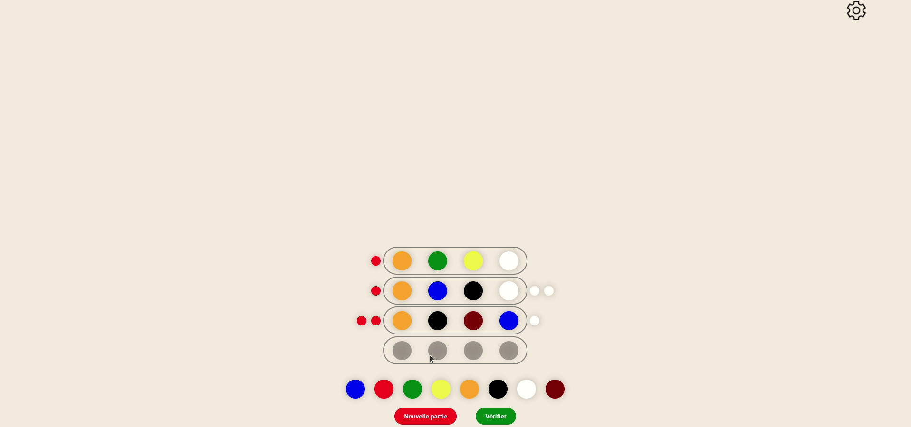

   <h1> Mastermind</ha>

   
   <h3> <strong>A mastermind game built with web technologies</strong> </h3>

  

     
    <a href="https://github.com/RomainGuarinoni/mastermind/blob/main/docs/user.md"><strong>User documentation</strong></a>
    ·
     <a href="https://github.com/RomainGuarinoni/mastermind/blob/main/docs/developper.md"><strong>Developper documentation</strong></a>
     
     
    <a href="https://romainguarinoni.github.io/mastermind/">Website</a>
    ·
    <a href="https://github.com/RomainGuarinoni/mastermind/issues/new/choose">Report Bug</a>
    ·
    <a href="https://github.com/RomainGuarinoni/mastermind/issues/new/choose">Request Feature</a>
  

>

## Built with

- [HTML](https://developer.mozilla.org/en-US/docs/Web/HTML)
- [CSS](https://developer.mozilla.org/en-US/docs/Web/CSS)
- [Typescript](https://www.typescriptlang.org/)
- [Webpack](https://webpack.js.org/)
- [Babeljs](https://babeljs.io/)

## Authors

- [Romain Guarinoni](https://github.com/RomainGuarinoni)
- [Guillaume Faure](https://github.com/Guillaume-FAURE)
