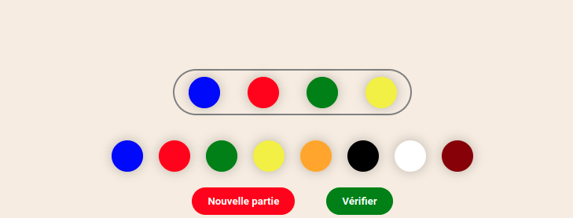
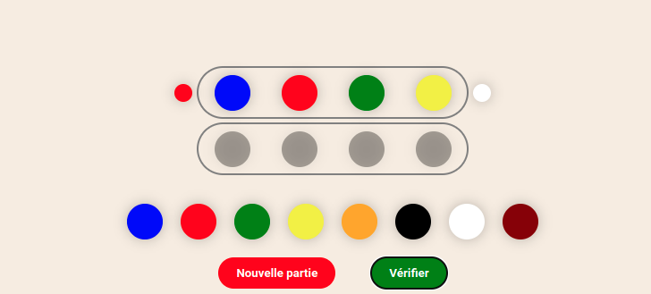
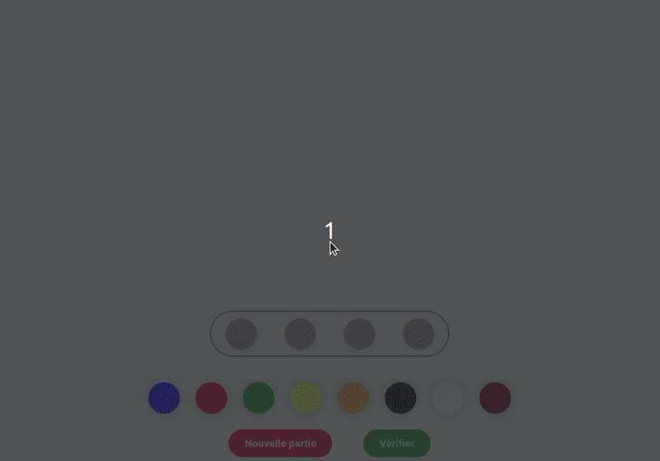
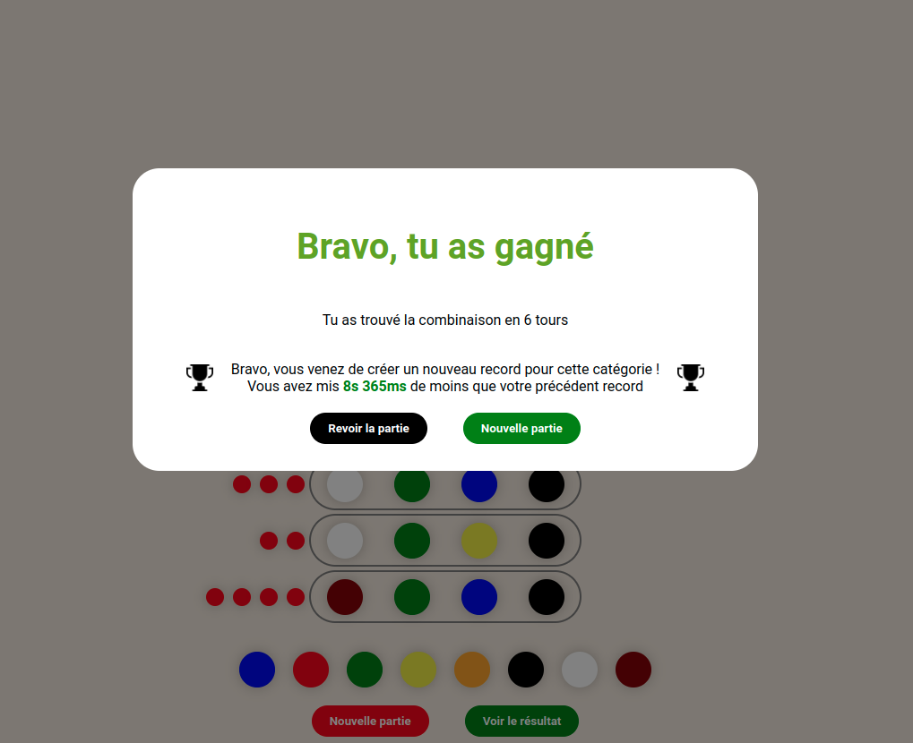

# User documentation

> Cette documention contiens tous les details sur les règles du mastermind,
> comment y jouer sur notre site web, les différrents paramètres disponible et
> enfin le système de record.

## Règles du mastermind

Le mastermind est un jeu ou le but est de trouver un code composé de diférrentes
couleurs en un nombre de tours définit.

Petit point histoire issu de wikipedia :

> C'est un jeu de réflexion, et de déduction, inventé par Mordecai Meirowitz,
> expert en télécommunications israëlien, dans les années 1970. Le jeu se base
> sur un jeu plus ancien : bulls and cows (en) (taureaux et vaches)qui se jouait
> avec papier et crayon et des nombres au lieu de couleurs. Au départ, il est
> édité par Capiépa en 1971.

## Déroulement d'une partie

### La création du code secret

Lorsque vous lancez une nouvelle partie, un nouveau code secret va se générer
automatiquement. Votre but va être de le trouver le plus vite possible.

### La création d'une combinaison

Pour pouvoir trouver quel est le code secret de la partie, vous allez devoir
créer des combinaisons de couleurs et faire des déductions pour trouver le bons
codes.

Pour cela, il suffit de déposer des couleurs dans la ligne en cours comme le
montre la photo ci dessous :

### La vérification de votre combinaison avec les indicateurs

Lorsque vous avez finis de disposer vos couleurs dans la ligne pour créer une
combinaison, vous aller devoir la vérifier en cliquant sur le bouton `Vérifier`.
Des indicateurs vont alors automtiquement se placer de chaque coté de votre
ligne :

- **indicateur rouge**: une des couleurs de la combinaison est bien placée
- **indicateur blanc**: une des couleurs de la combinaison est mal placée

Si aucun indicateur apparait, cela veut dire que aucune des couleurs de votre
combinaison se trouve dans la combinaison secrète.

Prenons l'exemple ci-dessous :

Dans cette combinaion:

- l'indicateur rouge inqique que l'une des couleurs est bien placé
- l'indicateur blanc indique que l'une des couleurs est mal placé
- deux couleurs ne sont pas présente dans la combinaison secrète

### Fin de la partie

Si vous arrivez à trouver la combinaison secrète avant le nombre d'essais
maximal, une fenètre vous indiquant votre victoire apparaitra. Sinon, une
fenètre vous anoncera que vous avez perdu la partie.

## Comment y jouer

Pour jouer au mastermind sur
[notre site](https://romainguarinoni.github.io/mastermind/), il suffit de
glisser les couleurs dans les emplacements de la ligne en cours en utilisant le
système du
[glisser déposer](https://fr.wikipedia.org/wiki/Glisser-d%C3%A9poser).

## Les différends paramètres

En cliquant sur l'icone paramètres en haut a droite de votre écran, vous pourrez
accéder aux différends paramètres du jeux mastermind :

1. **Couleurs dupliquées**: permet de définir si la combinaison secrète peut
   contenir des couleurs en double ou non
2. **Nombre de couleurs**: permet de définir le nombre de couleur accessible
   pourr créer une combinaison
3. **Nombre de tours**: permet de définir le nombre de tours que dure la partie
4. **Nombre de possibilités par ligne**: permet de définir le nombre de couleurs
   (distincte ou non) que possède une combinaison.

Lorsque que vous changez l'un de ces paramètres, une nouvelle partie se lance
automatiquement.

## Système de record

A chaque fin de partie, une sauvegarde de votre temps est effectué et la fenètre
de résultat vous affiche si vous avez battu votre meilleur temps ou pas.

Votre temps est comparé à votre meilleur temps dans la même catégorie, une
catégorie étant défini par les paramètres de la partie.

Voici un exemple de fenètre de résultat affichant un résultat de record :

